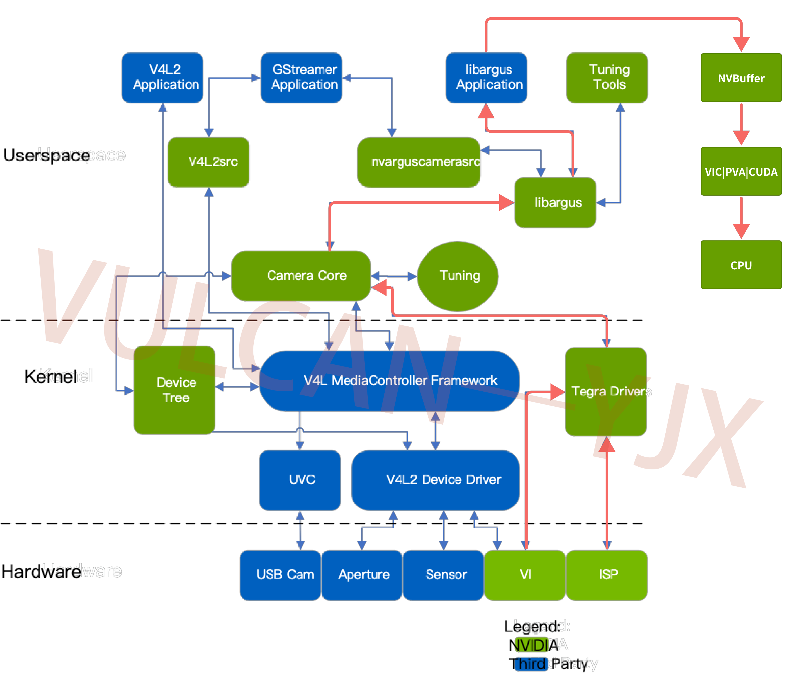
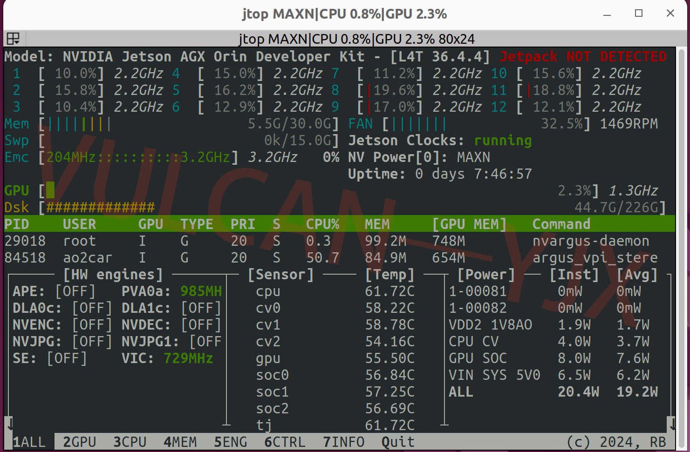
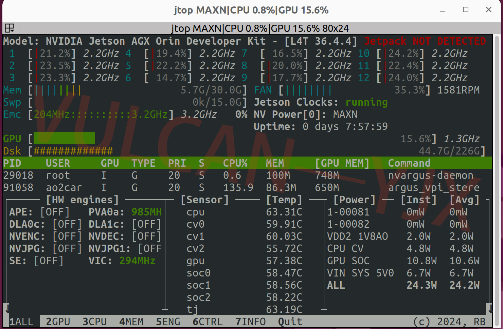
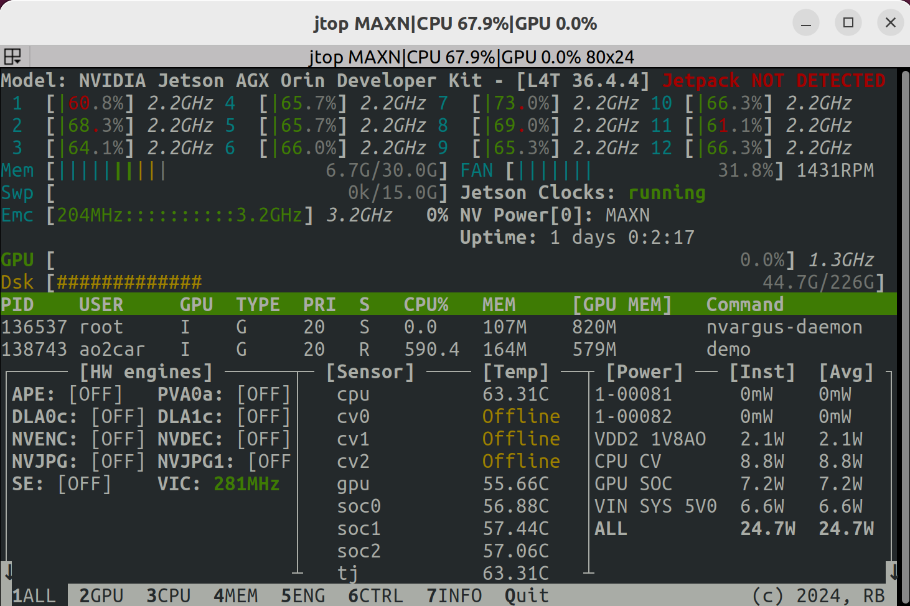
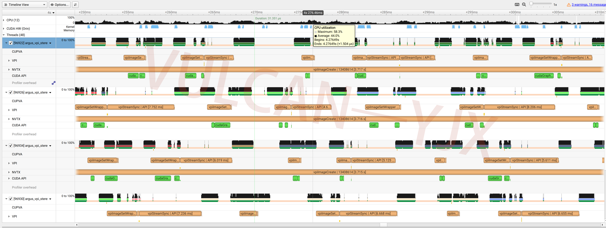
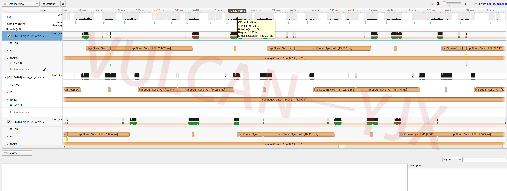

<p align="center"><strong>Jetson-Argus-Camera</strong></p>
<p align="center"><a href="https://github.com/Vulcan-YJX/Argus_vpi_camera_pipeline/blob/dev/LICENSE"></a>


</p>
<p align="center">
    语言：<a href="./docs/README_en.md"><strong>English</strong></a> / <strong>中文</strong>
</p>

​	此项目为了追求在 `jetson` 设备中获得优性能的数据流。并使用 `4` 路 `HAWK` (共 `8` 路摄像头, `1920x1200x30FPS`) 进行测试，在现有测试环境下尽可能的放大了每一个步骤的性能损失。并在[官方描述](https://docs.nvidia.com/jetson/archives/r34.1/DeveloperGuide/text/SD/CameraDevelopment/CameraSoftwareDevelopmentSolution.html)的相机处理流程图中进行了拓展，红色箭头描述了数据的流向。本次测

> [!IMPORTANT]
>
> 得的最优路线为：`vi—>isp—>gpu—>vic—>cpu`


如果您有更优秀的实现方案，欢迎指正。



## 基本信息

| Installation method | Supported platform[s]    | Sensor               |
| ------------------- | ------------------------ | -------------------- |
| Source              | Jetpack 6.2.1 , Orin AGX | Hawk x 4 , P3762-A03 |

------


## 环境准备

​	测试环境为 `Jetpack 6.2.1` 请确保您已经安装了 `jetson-multimedia` 和 `vpi3-dev` 。

```bash
git clone https://github.com/Vulcan-YJX/Argus_vpi_camera_pipeline.git
cd Argus_vpi_camera_pipeline
mkdir build && cd build
cmake ..
make -j	
```

> [!NOTE]
>
> 非常抱歉，在编译的时候会有许多 `warning`。这是因为里面的很多库文件是从 `jetson-multimedia` 的工程中复制出来的。我并没有逐一修改，因为随着版本的更迭，可能当前的文件也不能适配以后的 `jetpack` 了。


## 性能指标

​	在读取摄像头数据的同时，为了放大不同计算单元对不同算子处理的资源影响，我增加了一个去畸变的操作。对每一张图片进行了畸变矫正。在下方附带了不同流程下的 `jtop` 资源占用。

- 最优解：`vi—>isp—>gpu—>vic—>cpu`
  - 在 `vic｜pva` 中计算大部分的图像处理算子，使 `cpu` 和 `gpu` 的资源都得到了较大的节省。比较惊喜的点是在使用了 `vic` 后 `cpu` 的资源消耗也得到了一定程度的降低。 



------

- 次选：`vi—>isp—>gpu—>cpu`
  - 使全部的计算都在 `cuda` 中实现。优点是支持大部分算子，不用考虑在计算单元转换时带来的性能损失。缺点是整个的资源占用都有所提升。



------

- 最差选择：`cpu`
  - 为了对比 `opencv` 处理带来的性能差距，准备了一个反面案例，这也是最多人最常用的。在摄像头数量少的时候可能看起来差距不明显。随着处理的增多，就会一点点的增加资源的损耗。




------

​	`jtop` 上可以看到宏观的表现是 `cuda` 的资源占用更高，而带 `vic` 的版本会更低 。于是我又在 nsys 中查看了各个环节的资源利用。



------



​	从上图可以比较出，`CPU` 的占用峰值主要来自于 `vpiImageSetWrapper` 这个动作前后。而 `vic` 的数据管道看起来要 "更干净" 交换的更少。这里仅仅是猜测，可能是 `CPU` 在控制转换的过程中，而这个过程出现了资源损耗。

> [!TIP]
>
> 在使用 `VPI` 时，可以使用多流的方式，来提高硬件利用率。并参[照官方测试](https://docs.nvidia.com/vpi/algo_remap.html)的 `performance` 来根据项目选择合适的器件。	

------

<table style="border: 1px solid #f44336; background-color: #ffcccb; padding: 10px;">
<tr>
  <td>⚠️ <strong>注意：</strong> 分享这个工作，我只希望能够尽可能减少在jetson中使用opencv处理图像的人。把一坨代码扔进来，吃光了资源然后让其他人的工作无法进行，这是灾难性的。</td>
</tr>
</table>
