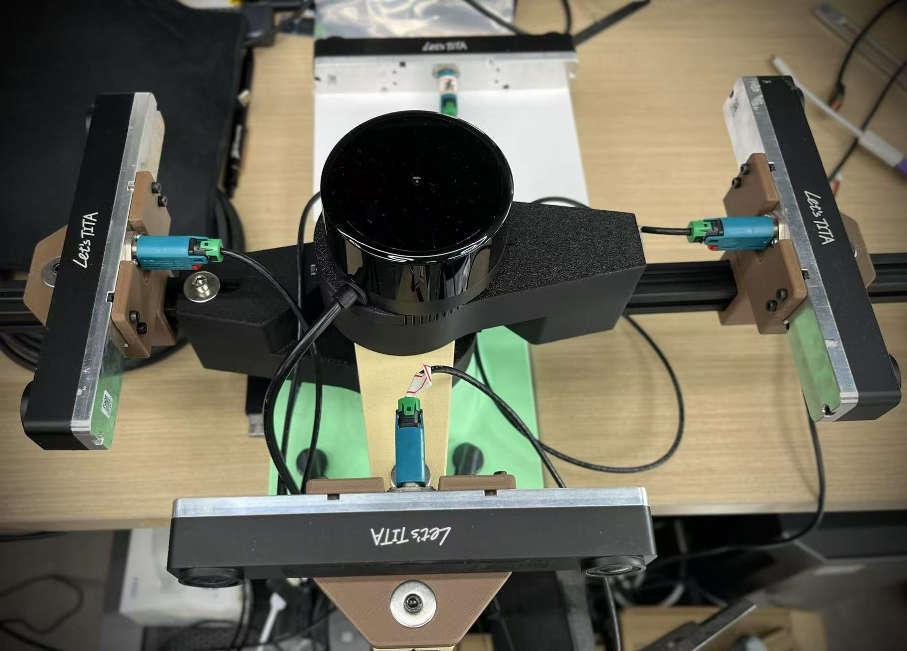

<p align="center"><strong>Jetson-Argus-Camera</strong></p>
<p align="center"><a href="https://github.com/Vulcan-YJX/Argus_vpi_camera_pipeline/blob/dev/LICENSE"></a>


</p>
<p align="center">
    语言：<a href="./docs/README_en.md"><strong>English</strong></a> / <strong>中文</strong>
</p>

​	This project aims to achieve high-performance data streaming on Jetson devices. It utilizes `4` HAWK channels (a total of `8` cameras, `1920x1200x30FPS`) for testing, maximizing the performance loss at each step within the current testing environment. Additionally, the camera processing flowchart described in the [official documentation](https://docs.nvidia.com/jetson/archives/r34.1/DeveloperGuide/text/SD/CameraDevelopment/CameraSoftwareDevelopmentSolution.html) has been expanded, with red arrows illustrating the flow of data.

> [!IMPORTANT]
>
> The best performance pipeline：`vi—>isp—>gpu—>vic—>cpu`


If you have a better implementation solution, welcome your feedback.


## Basic information

| Installation method | Supported platform[s]    | Sensor               |
| ------------------- | ------------------------ | -------------------- |
| Source              | Jetpack 6.2.1 , Orin AGX | Hawk x 4 , P3762-A03 |




------


## Environment

​	The testing environment is `Jetpack 6.2.1`. Please ensure that `jetson-multimedia` and `vpi3-dev` are installed.

```bash
git clone https://github.com/Vulcan-YJX/Argus_vpi_camera_pipeline.git
cd Argus_vpi_camera_pipeline
mkdir build && cd build
cmake ..
make -j	
```

> [!NOTE]
>
> I sincerely apologize for the numerous `warnings` during compilation. This is because many library files were copied from the `jetson-multimedia` project. I did not modify them individually, as with future version updates, the current files may no longer be compatible with upcoming `Jetpack` releases.


## Performance

​	While reading camera data, I added a distortion correction operation to amplify the resource impact of different computational units processing different operators. Each image undergoes distortion correction. Below is the `jtop` resource usage under different workflows:

- Optimal solution: `vi → isp → gpu → vic → cpu`
  - Most image processing operators are computed in `vic | pva`, significantly saving resources on both `cpu` and `gpu`. A surprising outcome was that using `vic` also reduced `cpu` resource consumption to some extent.


------

- Second choice：`vi—>isp—>gpu—>cpu`
  - Implement all computations in `CUDA`. The advantage is that it supports most operators without needing to consider performance loss caused by switching between computational units. The disadvantage is that overall resource usage increases.


------

- The worst choice：`cpu`
  - To compare the performance gap caused by OpenCV processing, a counterexample has been prepared, which is also the most commonly used approach by many. When the number of cameras is small, the difference may seem insignificant. However, as the camera number increases, the resource consumption gradually grows.


------

​	On `jtop`, the macro performance shows that `CUDA` has higher resource usage, while the version with `VIC` has lower usage. Therefore, I also checked the resource utilization of each stage in `nsys`.


------


​	From the above chart, it can be observed that the peak `CPU` usage mainly comes from the actions before and after `vpiImageSetWrapper`. Meanwhile, the data pipeline with `VIC` appears to be "cleaner" with fewer exchanges. This is just a hypothesis—it could be that the `CPU` is managing the conversion process, leading to resource consumption during this phase.

> [!TIP]
>
> When using `VPI`, a multi-stream approach can be utilized to improve hardware utilization. Refer to the [official tests](https://docs.nvidia.com/vpi/algo_remap.html) under the `Performance` section to select the appropriate device for the project.	

------

<table style="border: 1px solid #f44336; background-color: #ffcccb; padding: 10px;">
<tr>
  <td>⚠️ <strong>Note:</strong> By sharing this work, I only hope to minimize the use of OpenCV for image processing on Jetson as much as possible. Throwing in a chunk of code that consumes all resources and prevents others from working is catastrophic.
</td>
</tr>
</table>

